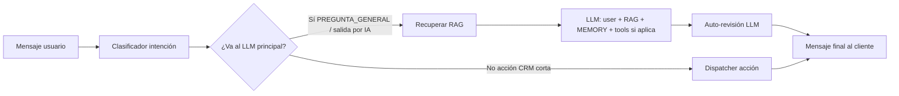

# Pipeline del asistente (intención → RAG → LLM → revisión)

Este documento es la referencia del **flujo que queremos como modelo mental**: primero la respuesta generativa con contexto, luego una pasada de **razonamiento / auto-revisión** que usa los mismos hechos (RAG) y el hilo reciente, y recién entonces el mensaje al cliente. También cubre cómo encaja Agenda (RAG + SQL) **sin imports** `chatbot` ↔ `agenda`.

## Tres intenciones de producto (clasificador + rutas)

El mini-LLM (`IntentClassifierService` + `BotPrompts.IntentClassifier`) debe distinguir sobre todo estas tres rutas cuando el usuario escribe en español:

| Ruta | Etiqueta / acción | Comportamiento |
|------|-------------------|----------------|
| **Información del negocio** | `PREGUNTA_GENERAL` (y a veces `SALUDO`) | Entra al pipeline generativo: RAG (`knowledge_chunk` + Agenda sync) + LLM + auto-revisión si está activa. **Horarios:** el prompt prioriza la herramienta `getHorario` frente a solo fragmentos RAG, para reducir horarios desactualizados. |
| **Mis citas (Agenda)** | `ACCION_CRM view_agenda_bookings_by_contact` | Atajo: consulta por teléfono. **WhatsApp:** usa el `from` del chat (sin OTP). Otros canales: pide teléfono. |
| **Agendar / reservar nueva cita** | `ACCION_CRM get_agenda_public_url` | Atajo: `GetAgendaPublicUrlAction` → mensaje amistoso + URL pública `{agenda.public.base-url}/#/agenda/{slug}`. **No** se pide cédula ni se completa la reserva en el chat. Es la única ruta de producto para una reserva nueva. |

Otras acciones CRM (p. ej. `create_lead`) siguen el mismo patrón de atajo por dispatcher cuando el clasificador las devuelve.

## Flujo canónico (respuestas generativas)

1. **Intención** — Mini-LLM: saludo, pregunta general, mala intención, o `ACCION_CRM <action_id>`.
2. **RAG** — Para turnos generativos (`RagAiContextBuilder` → `KnowledgeService.retrieveForTurn`): embeddings, historial en la query, filtro por topic, gate CRAG, chunks Agenda (`AgendaRagSourceSync`). Config y pendientes: [RAG_ROADMAP.md](./RAG_ROADMAP.md). **Implementación completa:** [BOT_IMPLEMENTATION.md](./BOT_IMPLEMENTATION.md).
3. **LLM principal** — `chatClientWithTools`: mensaje actual, system con fragmentos + fecha + reglas, **memoria** (`PromptChatMemoryAdvisor`), y herramientas cuando aplica (p. ej. `getHorario`, consultas de citas existentes, cancelación).
4. **Razonamiento / auto-revisión** — Segunda llamada con `chatClientPlain` (parte fija del pipeline generativo).
5. **Respuesta al cliente** — Texto validado (`ResponseValidator`) y envío por el canal.

### Mejoras posibles (recomendaciones)

| Idea | Beneficio |
|------|-----------|
| Modelo más chico o cuantizado solo para la revisión | Menor costo/latencia en el paso 4 |
| Salida estructurada (p. ej. JSON `{"final":"...","changed":true}`) | Menos ambigüedad; descartar si `changed` y contradice FACTS |
| Revisor con temperatura 0 y límite de tokens bajo | Menos reescritura innecesaria |
| Métricas: tasa de cambio draft→final, longitud, tiempo | Afinar `bot.llm.temperature.self-review` |
| Incluir en FACTS también el resultado de tools del turno (extracto) | Mejor coherencia cuando el borrador cita datos de herramientas |

## Qué queda fuera del pipeline generativo (atajos CRM)

| Intención | Comportamiento |
|-----------|----------------|
| `get_agenda_public_url` | URL pública + texto fijo amistoso; JDBC a `agenda_businesses.public_slug`. |
| `view_agenda_bookings_by_contact` | Reservas futuras por teléfono; WhatsApp = identidad del canal (sin OTP). |

## Sincronización Agenda → RAG

- `AgendaRagSourceSync` al arranque y tras cambios: JDBC sobre `agenda_*`, upsert en `knowledge_chunk`, `embedding = NULL` si cambia el texto.
- Chunks por sucursal cuando aplica (`business_id`).

## Configuración

- `agenda.public.base-url` — Base del **frontend** para el link público de agenda.
- Motor RAG/LLM — umbrales en `bot.rag.*`, `bot.llm.temperature.*` (ver [BOT_IMPLEMENTATION.md](./BOT_IMPLEMENTATION.md) §11).

## Verificación teléfono (solo reserva pública)

Al **reservar** desde la web pública (`POST .../phone-verification/send|verify`), se envía OTP por WhatsApp para confirmar titularidad del teléfono antes de `POST .../bookings`.

**Mis citas por WhatsApp:** no lleva OTP (el canal ya identifica al usuario).

Config: `agenda.phone.verification.*` en `application.yml`.

## Riesgos residuales

Consulta de citas en canales no WhatsApp: quien conozca el teléfono puede listar turnos. Reserva web: mitigado con OTP.

## Archivos clave

- Clasificación: `IntentClassifierService`, `BotPrompts.IntentClassifier`
- RAG: `RagAiContextBuilder`, `KnowledgeService`, `AgendaRagSourceSync`
- LLM + revisión: `RagLlmChatService`, `BotEngineConfig` (`chatClientPlain`, `chatClientWithTools`)
- Acciones cortas: `GetAgendaPublicUrlAction`, `ViewAgendaBookingsByContactAction`
- Enrutado CRM: `ConversationActionRouting`, `ActionDispatcher`.

## Citas en el chat (distinto de reservar nueva)

Nueva reserva: solo enlace de agenda (`get_agenda_public_url`). Para **citas ya existentes**, el asistente puede usar herramientas del motor de chat (listado / cancelación, etc.) según el system prompt y lo que pregunte el usuario.
