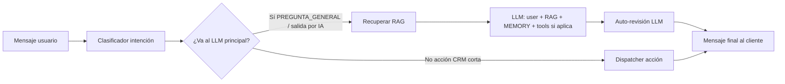

# Pipeline del asistente (intención → RAG → LLM → revisión)

Este documento es la referencia del **flujo que queremos como modelo mental**: primero la respuesta generativa con contexto, luego una pasada de **razonamiento / auto-revisión** que usa los mismos hechos (RAG) y el hilo reciente, y recién entonces el mensaje al cliente. También cubre cómo encaja Agenda (RAG + SQL) **sin imports** `chatbot` ↔ `agenda`.

## Flujo canónico (respuestas generativas)

1. **Intención** — Mini-LLM (`IntentClassifierService` + `BotPrompts.IntentClassifier`): saludo, pregunta general, mala intención, o `ACCION_CRM <action_id>`.
2. **RAG** — Para turnos que entran al chat generativo (`RagAiContextBuilder`): embeddings + `knowledge_chunk` por `tenant_id`, incluyendo chunks **Agenda** mantenidos por `AgendaRagSourceSync` (negocio, servicios, horarios, políticas).
3. **LLM principal** — `chatClientWithTools`: mensaje actual, system con fragmentos + fecha + reglas, **memoria** (`PromptChatMemoryAdvisor`), y herramientas cuando el flujo lo requiere.
4. **Razonamiento / auto-revisión** — Si `bot.rag.self-review-enabled=true` y **no** es el flujo `book_appointment` (muchas tool-calls): segunda llamada con `chatClientPlain` y `BotPrompts.RagChat.buildSelfReviewSystemPrompt`, que recibe:
   - **FACTS (RAG)** del turno,
   - **RECENT THREAD** (historial persistido `user`/`assistant` de la sesión),
   - **mensaje actual**,
   - **borrador** del paso 3.  
   El modelo debe devolver **solo** el texto final en español, sin meta-comentarios. Guardrails en código: no aceptar refinados vacíos o demasiado recortados (`RagLlmChatService.wouldDiscardRefinement`).
5. **Respuesta al cliente** — Texto validado (`ResponseValidator`) y envío por el canal.

### Mejoras posibles (recomendaciones)

| Idea | Beneficio |
|------|-----------|
| Modelo más chico o cuantizado solo para la revisión | Menor costo/latencia en el paso 4 |
| Salida estructurada (p. ej. JSON `{"final":"...","changed":true}`) | Menos ambigüedad; descartar si `changed` y contradice FACTS |
| Revisor con temperatura 0 y límite de tokens bajo | Menos reescritura innecesaria |
| Métricas: tasa de cambio draft→final, longitud, tiempo | Afinar `self-review-enabled` en prod |
| Incluir en FACTS también el resultado de tools del turno (extracto) | Mejor coherencia cuando el borrador cita datos de herramientas |

## Qué queda fuera del pipeline generativo (atajos CRM)

Hoy el **modelo mental** del producto es el pipeline de cinco pasos de arriba. Para **dos** intenciones la implementación actual **acorta** el camino: no hay RAG + primer LLM + auto-revisión; el `ActionDispatcher` ejecuta lógica directa (JDBC) y la respuesta sale al cliente. Motivos: menor latencia, menos costo de tokens y flujos muy acotados (un dato estructurado o un listado SQL).

| Intención | Comportamiento |
|-----------|----------------|
| `get_agenda_public_url` | URL pública `{agenda.public.base-url}/#/agenda/{slug}` vía JDBC a `agenda_businesses`. |
| `view_agenda_bookings_by_contact` | Pide email o teléfono; consulta `agenda_bookings` / `agenda_users` (futuras, `PENDING`/`CONFIRMED`, tope 20). Sin OTP (ver riesgos). |

### Evolución posible: un solo pipeline para todo

Si en el futuro se exige que **ningún** turno salte RAG + LLM + revisión (incluso link y “mis citas”), la dirección sería:

1. **Tools** (Spring AI) que lean lo mismo que hoy los actions (slug público, bookings por contacto) y devuelvan texto o JSON al modelo.
2. El **primer LLM** arma la respuesta amigable usando tool output + RAG + historial.
3. La **auto-revisión** (paso 4) recibe FACTS (RAG + extracto del output de tools en el mismo turno) + hilo + borrador, igual que hoy.

Trade-offs: más latencia, más complejidad y que el revisor tenga acceso explícito a lo que devolvieron las tools (hoy la tabla de mejoras ya menciona “incluir resultado de tools en FACTS”).

### Legacy `view_appointments`

Los menús o clasificadores que aún digan `view_appointments` se **normalizan** a `view_agenda_bookings_by_contact` en `ActionDispatcher` y `IntentClassifierService`. **No** se usa la tabla `appointment` del bot para listar citas del cliente; ese flujo fue retirado.

## Flujo `book_appointment` (este chat, con tools)

Sigue siendo **LLM + herramientas** de citas del bot (`AgendarTools`, etc.). La auto-revisión del paso 4 está **desactivada** en ese flujo para evitar doble latencia y estados inconsistentes con tools; el “razonamiento” queda en el propio modelo + tools en el primer paso.

## Sincronización Agenda → RAG

- `AgendaRagSourceSync` al arranque: JDBC sobre `agenda_*`, upsert en `knowledge_chunk`, `embedding = NULL` si cambia el texto.
- Primer negocio activo del tenant (`created_at ASC`), alineado a **un negocio por tenant** en el bot.

## Configuración

Definido en [`application.yml`](../src/main/resources/application.yml) (y variables de entorno donde aplique):

- `agenda.public.base-url` — Base del **frontend** para armar el link público de agenda (no el backend).
- `bot.rag.self-review-enabled` — Activa el paso 4 (razonamiento post-borrador con RAG + hilo). `true` alinea con el pipeline canónico en preguntas generales; implica **segunda llamada** al modelo (más latencia). Comentario en YAML: referencia a este documento.

## Riesgos: “mis citas” sin verificación

Quien conozca el email o teléfono puede listar turnos futuros. Mitigaciones actuales: solo futuras, estados acotados, límite. Evolución: OTP, código de reserva, o identidad del canal.

## Archivos clave

- Clasificación: `IntentClassifierService`, `BotPrompts.IntentClassifier`
- RAG: `RagAiContextBuilder`, `KnowledgeService`, `AgendaRagSourceSync`
- LLM + revisión: `RagLlmChatService`, `BotEngineConfig` (`chatClientPlain`, `chatClientWithTools`)
- Acciones cortas: `GetAgendaPublicUrlAction`, `ViewAgendaBookingsByContactAction`
- Compat menú legacy: `ActionDispatcher.canonicalActionIntent`
