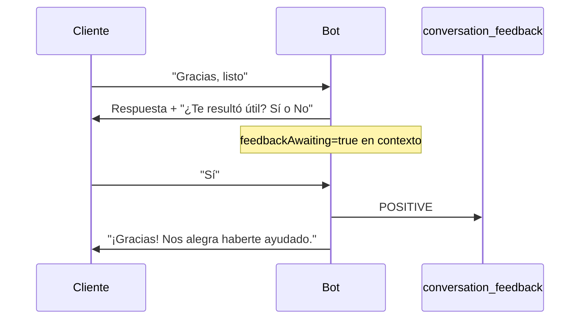

# Implementación del asistente (bot) — referencia técnica

Documento maestro del módulo **chatbot** en `chatbot-engine`: arquitectura, capas de conocimiento, RAG, tools, feedback al cliente y APIs de administración.

Documentos relacionados:

- [BOT_AGENDA_INTENTS.md](./BOT_AGENDA_INTENTS.md) — pipeline intención → RAG → LLM
- [RAG_ROADMAP.md](./RAG_ROADMAP.md) — evolución RAG (resumen)
- [ESTRATEGIA_IA_Y_AGENDAR.md](./ESTRATEGIA_IA_Y_AGENDAR.md) — estrategia de producto (contexto)

---

## 1. Principio de producto

El bot es un **asistente del negocio** que habla en primera persona plural («nosotros»). Al cliente **nunca** se le muestran detalles técnicos: ni RAG, chunks, topics, herramientas, APIs, bases de datos ni nombres internos de sistemas.

Toda la metadata técnica vive en logs, panel admin y este documento.

---

## 2. Arquitectura por capas

```
Canal (WhatsApp / Web / Telegram)
        ↓
ProcessInboundMessageUseCase → ConversationCore
        ↓
ChatSessionService (sesión + idle)
        ↓
ConversationFeedbackFlowService (¿Sí/No pendiente?)
        ↓
ConversationModeOrchestrator
        ↓
Modo: FAQ_ONLY | FAQ_AND_AI | AI_ONLY
        ↓
FaqConversationService / RagLlmChatService / acciones CRM
```

| Capa | Paquete | Rol |
|------|---------|-----|
| Dominio | `com.botai.domain.chatbot` | POJOs, puertos, feature flags |
| Aplicación | `com.botai.application.chatbot` | Casos de uso, orquestación, prompts |
| Infraestructura | `com.botai.infrastructure.chatbot` | JPA, canales, Spring AI, config |

Patrón **hexagonal**: el dominio no importa Spring ni JPA.

---

## 3. Modos de conversación

Resuelto por `ConversationModeResolver` según flags del tenant (`FAQ_ENABLED`, `AI_ENABLED`):

| FAQ | IA | Modo | Comportamiento |
|-----|-----|------|----------------|
| ✓ | ✓ | `FAQ_AND_AI` | Menú/FAQ primero; si no hay match → LLM |
| ✓ | ✗ | `FAQ_ONLY` | Solo menú + FAQ fijas |
| ✗ | ✓ | `AI_ONLY` | Directo a RAG + LLM |
| ✗ | ✗ | `NONE` | Sin respuesta (`no_match`) |

Atajos CRM (antes del modo): enlace de reserva nueva, ver mis citas Agenda.

---

## 4. Capas de conocimiento (modelo inspirado en CogSol)

### 4.1 Fragmentos RAG (`knowledge_chunk`)

- Sincronizados desde Agenda (`AgendaRagSourceSync`) y/o creados manualmente en admin.
- Búsqueda semántica (pgvector) + fallback por keywords.
- Filtro por **topic** (`RagTopicHintService`: prefijos `Agenda: Horarios`, etc.).
- **Gate CRAG**: si la similitud promedio o por chunk es baja, no se inyectan fragmentos al prompt (el LLM usa tools o mensaje conservador).

**Columnas relevantes:**

| Columna | Uso |
|---------|-----|
| `tenant_id` | Aislamiento multi-tenant |
| `business_id` | Sucursal Agenda (sync) |
| `topic` | Filtro semántico (interno) |
| `content` | Texto que ve el LLM (sin prefijo `[topic]` al usuario) |
| `keywords` | Fallback textual |
| `source_type` | `MANUAL`, `AGENDA_SYNC`, etc. |
| `language` | Filtro futuro / metadata |
| `valid_until` | Chunk temporal; excluido del retrieval si expiró |
| `embedding_384` / `embedding_1536` | Vector según perfil embedding |

### 4.2 FAQ (`faq`) — global

Dos modos (`response_mode`):

| Modo | Comportamiento |
|------|----------------|
| `FIXED` | Respuesta **literal** al cliente (short-circuit antes del LLM) |
| `RAG_HINT` | No responde directo; inyecta Q+A al **contexto generativo** para que el LLM parafrasee |

Matching: keywords (contains) o regex (`use_regex`).

### 4.3 Lessons (`bot_lesson`) — por tenant

Reglas de tono, jerga o políticas activadas por **keywords** en la consulta del usuario.

Ejemplo: «Nunca digas que llamen por teléfono; usa el enlace web».

Se inyectan en el system prompt solo cuando el mensaje coincide con `trigger_keywords`.

### 4.4 Fixed vs generativo (resumen)

```
Usuario pregunta
    → ¿FAQ FIXED?     → respuesta literal
    → ¿FAQ RAG_HINT?  → pista en prompt LLM
    → RAG chunks      → contenido verificado
    → Lessons         → reglas contextuales
    → Tools           → horario, servicios, citas, enlace reserva
    → LLM + self-review → respuesta final en español natural
```

---

## 5. Pipeline RAG + LLM (turno generativo)

Clase principal: `RagLlmChatService` → `RagAiContextBuilder` → `KnowledgeService.retrieveForTurn`.

1. **Query expandida** con historial reciente (`RagQueryExpander`, `bot.rag.history-turns-for-query`).
2. **Hints de topic** según la pregunta.
3. **Lessons** activas para el tenant.
4. **FAQ RAG_HINT** si hay match de keywords.
5. **Embedding search** + CRAG.
6. **System prompt**: fecha, reglas, fragmentos (solo `content`), URL de reserva, tono de confianza (`RagAttributionHints`).
7. **LLM** con tools (`chatClientWithTools`) y memoria Spring AI.
8. **Self-review** (`chatClientPlain`) — siempre en el pipeline generativo.
9. **Validación** de salida (`DefaultResponseValidator`).

### Tono de confianza (sin detalle técnico al cliente)

`RagAttributionHints` instruye al modelo a usar frases naturales («según nuestros horarios», «con la información que tenemos»). **No** se envían topics ni IDs al usuario.

### Sin fragmentos RAG

Si CRAG rechaza o no hay chunks:

- El prompt indica usar tools (`getHorario`, `listarServicios`, `buscarConocimiento`).
- Mensaje modelo cuando falta dato: `bot.messages.noRagInfo` (override opcional).
- El LLM sigue con tools y reglas conservadoras (un solo camino; no hay modo «cortar sin LLM»).

---

## 6. Tools del agente (Spring AI)

| Tool | Clase | Uso |
|------|-------|-----|
| `getHorario` | `ConsultaTools` | Horarios Agenda |
| `listarServicios` | `ConsultaTools` | Servicios activos |
| `buscarConocimiento` | `ConsultaTools` | Búsqueda RAG bajo demanda |
| `obtenerEnlaceReservaOnline` | `AgendaPublicUrlTools` | URL pública reserva **nueva** |
| Citas legacy | `AgendarTools` | Ver/cancelar citas tabla `appointment` |

**Reserva nueva:** solo enlace web, no wizard en chat.

**Límite por turno:** `bot.tools.max-calls-per-turn` (default 4).

Contexto de tenant/conversación: `ThreadTenantContext` (seteado en `RagLlmChatService`).

---

## 7. Generación por etapa (LLM)

Temperaturas en `bot.llm.temperature.*` (umbrales, no modos):

| Etapa | Clave YAML | Default |
|-------|------------|---------|
| Clasificador | `classifier` | 0.1 |
| Respuesta RAG | `rag-reply` | 0.3 |
| Self-review | `self-review` | 0.0 |

- **Clasificador:** `IntentClassifierService` → `SpringAiLanguageModel` con `forClassifier()`.
- **Respuesta RAG:** `RagLlmChatService` con `forRagReply()`.
- **Self-review:** segunda pasada con `forSelfReview()`.

---

## 8. Sesiones de chat

`ChatSessionService`:

- Una **sesión** (`chatSessionId`) acota historial LLM y tabla `message`.
- Nueva sesión si: inactividad (`bot.session.idle-minutes`, default 45), reset explícito, o primera vez.

---

## 9. Feedback al cliente (fin de conversación)

### 9.1 Flujo automático (WhatsApp / web / Telegram)

Implementado en `ConversationFeedbackFlowService`, integrado en `ConversationCore`.



**Detección de cierre:** `InboundTextHeuristics.looksLikeConversationClosing` — despedidas sin pregunta nueva («Gracias», «Chau», «Nada más», «Listo»).

**Respuesta:** `InboundTextHeuristics.parseFeedbackYesNo` — acepta sí/sip/yes/util/bien vs no/nop/mal.

**Persistencia:** tabla `conversation_feedback` con snapshot del último intercambio (user, bot, intentSource).

**Configuración:** siempre activo en el pipeline. Textos opcionales vía `bot.messages.feedback*`:

```yaml
bot:
  messages:
    feedbackQuestion: "¿Te resultó útil esta conversación? Respondé Sí o No."
    feedbackThanksPositive: "¡Gracias! Nos alegra haberte ayudado."
    feedbackThanksNegative: "Gracias por contarnos. Trabajaremos para mejorar."
    feedbackThanksUnclear: "Respondé Sí o No para saber si te fue útil."
```

Claves de contexto (`ConversationContextKeys`): `feedbackAwaiting`, `feedbackSnapshotUser`, `feedbackSnapshotBot`, `feedbackSnapshotSource`.

### 9.2 API REST (admin / integraciones)

| Método | Ruta | Descripción |
|--------|------|-------------|
| POST | `/api/tenants/{tenantId}/conversations/{conversationId}/feedback` | Registrar feedback manual |
| GET | `/api/tenants/{tenantId}/feedback` | Listar recientes |
| POST | `/api/tenants/{tenantId}/feedback/{id}/promote-to-faq` | Promover feedback negativo a FAQ `FIXED` |

Body POST feedback:

```json
{
  "rating": "POSITIVE",
  "userMessage": "...",
  "botReply": "...",
  "sessionId": "...",
  "intentSource": "ai"
}
```

Body promote-to-faq:

```json
{
  "intent": "horario_sabado",
  "keywords": "sabado,horario",
  "response": "Texto corregido que debe decir el bot"
}
```

---

## 10. APIs de administración

| Recurso | Rutas |
|---------|-------|
| Knowledge chunks | `GET/POST/PUT/DELETE /api/tenants/{tenantId}/knowledge[/{id}]` |
| FAQ global | `GET/POST/PUT /api/faqs[/{id}]` |
| Lessons | `GET/POST/PUT /api/tenants/{tenantId}/lessons[/{id}]` |
| Feature flags | `/api/tenants/{tenantId}/features` |
| Bots | `/api/bots` |

---

## 11. Configuración

Principio: **un solo pipeline** (clasificador → FAQ/menú o RAG → LLM → self-review → validación). El YAML no elige caminos alternativos (`self-review-enabled`, `strict-no-info`, etc. no existen). Solo tunás **umbrales** e **infraestructura**.

### Infraestructura (`bot.embedding`, `bot.chat`, `bot.whatsapp`, `bot.channels`)

Proveedores, secretos y URLs por entorno.

### Umbrales operativos (`application.yml`)

```yaml
bot:
  rag:
    max-chunks: 3
    min-similarity: 0.0
    history-turns-for-query: 2
    crag-min-avg-similarity: 0.52
    crag-min-chunk-similarity: 0.40
    retrieval-prefetch-multiplier: 2
    embed-retry-delay-ms: 600000

  tools:
    max-calls-per-turn: 4

  memory:
    max-history-turns: 10

  session:
    idle-minutes: 45

  buffer:
    debounce-ms: 2500

  llm:
    temperature:
      classifier: 0.1
      rag-reply: 0.3
      self-review: 0.0
```

Binding tipado: `BotProperties.java`.

### Mensajes al cliente — `bot.messages.*` (opcional)

Override por entorno; defaults en `BotMessages.java`.

---

## 12. Tablas de base de datos (bot)

| Tabla | Descripción |
|-------|-------------|
| `faq` | FAQ global + `response_mode` |
| `knowledge_chunk` | RAG + metadata |
| `bot_lesson` | Lessons por tenant |
| `conversation_feedback` | Feedback Sí/No |
| `conversation` | Estado (menú, contexto, feedback pending) |
| `message` | Historial por sesión |
| `feature_config` | Flags por tenant |

Hibernate `ddl-auto: update` crea columnas/tablas nuevas al arrancar (solo módulo bot).

---

## 13. Clases clave (índice)

| Tema | Clases |
|------|--------|
| Entrada | `ConversationCore`, `ConversationModeOrchestrator` |
| FAQ | `FaqService`, `FaqConversationService` |
| RAG | `KnowledgeService`, `RagAiContextBuilder`, `RagLlmChatService` |
| Lessons | `BotLessonService` |
| Feedback | `ConversationFeedbackFlowService`, `ConversationFeedbackService` |
| Tools | `ConsultaTools`, `AgendarTools`, `AgendaPublicUrlTools`, `BotToolCallGuard` |
| Prompts | `BotPrompts` |
| Config | `BotEngineConfig`, `BotMessages`, `BotProperties` |

---

## 14. Tests

| Test | Qué valida |
|------|------------|
| `FaqServiceTest` | FIXED vs RAG_HINT |
| `BotLessonServiceTest` | Activación por keywords |
| `KnowledgeServiceRetrievalTest` | CRAG |
| `RagAttributionHintsTest` | Frases naturales sin topics |
| `RagGoldenSetRegressionTest` | Mensajes no técnicos |
| `ConversationFeedbackHeuristicsTest` | Cierre + Sí/No |

Comando:

```bash
cd backend && mvn test -Dtest='com.botai.application.chatbot.**'
```

---

## 15. Operación y mejora continua

1. **Feedback negativo** → revisar en `GET .../feedback` → `promote-to-faq` o ajustar chunks/lessons.
2. **CRAG rechaza mucho** → bajar `bot.rag.crag-min-*` o enriquecer `knowledge_chunk`.
3. **Respuestas sensibles** → FAQ `FIXED`, nunca `RAG_HINT`.
4. **Tono del negocio** → lessons por tenant.
5. **Self-review** siempre activa en turnos generativos; afinar con `bot.llm.temperature.self-review` si hace falta.

---

## 16. Lo que NO hace el bot

- Reservar turnos nuevos dentro del chat (solo enlace Agenda).
- Mostrar al cliente referencias técnicas a fuentes internas.
- Modificar tablas `agenda_*` directamente (sync unidireccional Agenda → chunks).
- Integración con plataformas externas tipo CogSol (solo patrones de diseño adoptados).
